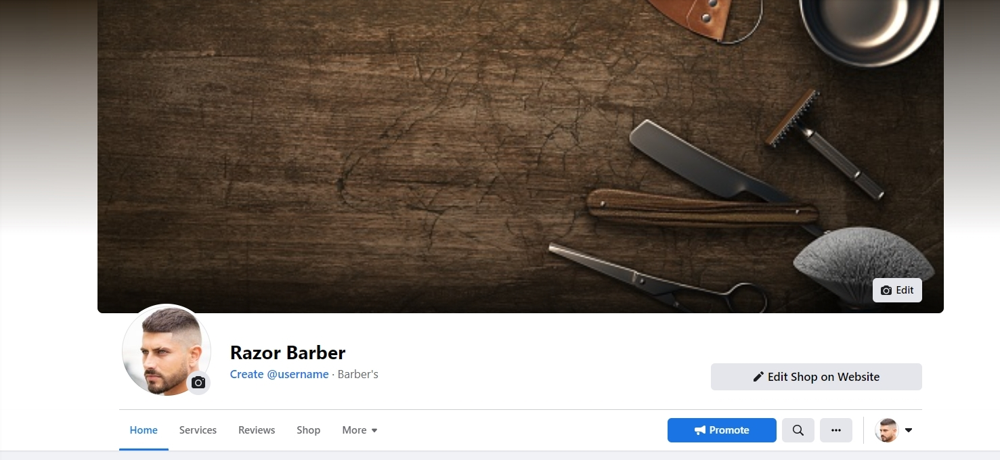
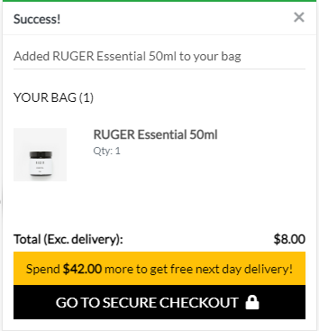
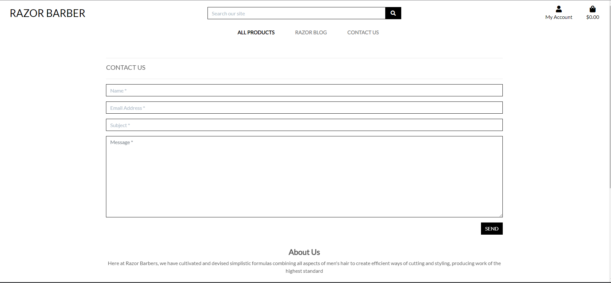

# Razor Barber

## Overview

Razor Barber is a website selling top of the range hair products as well as allowing users to book haircuts. Users are able to browse the selection of hair cproducts and purchase them. Users will be able to look at previous orders and update their delivery details if they register an account. Admin users can add, edit and delete products. Non-admin users are also able to add, edit and delete replies to the blog posts they have made.

[Link to deployed site](https://barber-django-ml.herokuapp.com/)

## Business Model

I have used a B2C buisness model for the site. The reason I chose this is because the products I will be selling are aimed at consumers and not businesses. The product selection and checkout flow allow for quick and easy purchases, which is not something you would use in a B2B environment. 

### Marketing Strategy

* I have made use of the following:

    * Social media advertising, due to it being a no cost option and potentially able to reach many users
    * Email advertising due to the relative simplicity of creating newsletters or offers for potential and existing customers
    * SEO and looking to rank well in searches on Google to aid visibility of my application

### Facebook Business Page

You can find a link to the business page [here.](https://www.facebook.com/Razor-Barber-108482478691688). There is also a link to tit in the footer of the site.

## UX

### User Stories

* New users

    * As a site user I can browse through products so that I can decide what I may be interested in buying
    * As a site user I can look at product details so that I can decide whether I would like to buy it
    * As a site user I can search for products so that I have another way of looking for items
    * As a site user I can sort products on criteria such as price so that I have a method of ordering the products as I prefer
    * As a site user I can add products I want to purchase to a basket so that I may then decide whether to purchase them or not
    * As a site user I can view the contents of my shopping basket so that I can make any adjustments to it
    * As a site user I can perform a checkout on my shopping basket so that I can create an order
    * As a site user I can register an account so that I can make use of features reserved for registered users
    * As a site user I can log in so that I can use features reserved for registered users
    * As a site user I can log out so that my account remains secure if I were to visit the site from a shared PC
    * As a site user I can view a profile for my user account so that I can see my order history and also make any adjustments to the details kept on record for me
    * As a site user I can submit a message to admin so that any feedback or issues can be raised to them
    * As a site user I can reply to blog posts so that I can express an opinion about them or add a comment 
    * As a site user I can edit my replies to the blog posts so that I may update them if needed
    * As a site user I can delete any of my replies to the blog posts so that I can remove them if I feel they’re no longer needed
    * As a site admin I can manage products so that I may add, update or delete them as needed
    * As a site admin I can manage user accounts so that any required changes to them can be made
    * As a site admin I can view created orders so that they may be fulfilled, or amended if needs be
    * As a site admin I can view messages submitted via the contact us section so that I may act upon them
    * As a site admin I can manage the content on the blog page so that it can be amended if needed

* Returning users

    * As a returning site user I can check to see if any new products have been added so that I can decide if I want to buy any
    * As a returning site user I can view my user profile (if I registered an account) so that I can edit my details and also view previous orders
    * As a returning site user I can see whether any new blog posts and associated replies have been added
    * As a returning site admin I can see whether any new messages have been submitted so that I can action them accordingly
    * As a returning site admin I can look at whether any new orders have been placed so that I can fulfill or amend them as required
    * As a returning site admin I can update the blog page content so that any required changes to it are reflected

User stories have also been recorded using GitHub issues and have been placed in the milsetone section under a 'Product Backlog' title. They can be seen [here.](https://github.com/mlenahan/ms-5-django/milestone/1)

I also used an Iteration Board to help with the planning of this project. That can be seen [here.](https://github.com/users/mlenahan/projects/4)

### Design

* Imagery

    * This website features a simple background image showing some texture on the homepage. The other images present are those for the products. I also make use of Font Awesome icons.

* Typography

    * The font used in my application is Lato. 

* Colour scheme

    * I have used a monochromatic colour scheme to align with my preference for clean, minimalistic approach to styling
 
 ### Schema

The schema overview for my application is as below:

 

As seen above, the Category table has a one-to-many link with Product as one category can contain many products.
The Order table has a one-to-many link with OrderLineItem, as one order can contain many line items. There is also a one-to-many link between Product and OrderLineItem as the same product can appear in many line items on different orders.  
There is a one-to-many relationship between UserProfile and Order as one user can have many orders associated with them. The UserProfile table also has a one-to-one link with the built-in Django User model (shown here for demonstration purposes) as each user can have only one profile linked to them. The BlogPost table has a one-to-many relationship with Reply, which allows for multiple replies to a particular blog post. There is also a one-to-many relationship between the User model and the Reply table as one user may have many replies.  

### Wireframes

Wireframes were created on Balsamiq (see links below)

* [Mobile](media/wireframes/mobile-wireframe.pdf)
* [Tablet](media/wireframes/tablet-wireframe.pdf)
* [Desktop](media/wireframes/desktop-wireframe.pdf)

Some final design choices aren't reflected in wireframes.

## Features

### Existing Features

Details of all site features are listed below.

Header contains a logo, nav items, a search bar, account icon and basket icon.

 

Homepage:

 

The footer contains an about us, link to socials, and a sign up to newletter.

 

Log in.

 

Logout.

 

Account registration.

 

Product overview.

 

Product detail

 

Added to basket.

 

Basket view.

 

Checkout.

 

Checkout success

 

Profile view.

 

Order details.

 

Blog overview.

 

Blog post detail.

 

Blog commenting. Comments can be edited and deleted.

 

Contact Us

 

Product management for admins.

 

Admin users can also edit and delete products:

 

## Features left to implemement

I attempted to add a booking system to this site but I couldn't find a solution to create a reservation. i have still included some of the booking flow in the site but have added an error page which lets the user know the system is down.

Book now button on homepage.

 

Service selection.

 

Barber selection.

 

Custom error page.

 