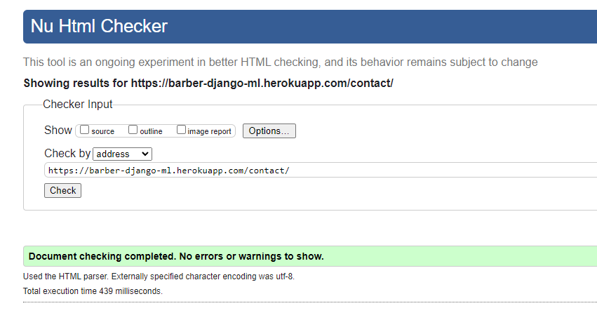
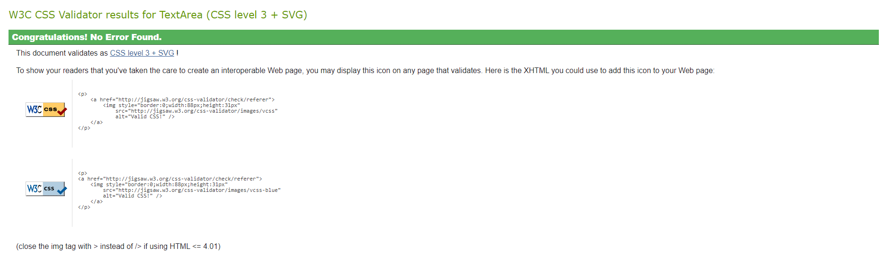

# Testing

## User Stories 

* As a site user I can browse through products so that I can decide what I may be interested in buying

* As a site user I can look at product details so that I can decide whether I would like to buy it

* As a site user I can search for products so that I have another way of looking for items

* As a site user I can sort products on criteria such as price so that I have a method of ordering the products as I prefer

* As a site user I can add products I want to purchase to a basket so that I may then decide whether to purchase them or not

* As a site user I can view the contents of my shopping basket so that I can make any adjustments to it

* As a site user I can perform a checkout on my shopping basket so that I can create an order

* As a site user I can register an account so that I can make use of features reserved for registered users

* As a site user I can log in so that I can use features reserved for registered users

* As a site user I can log out so that my account remains secure if I were to visit the site from a shared PC

* As a site user I can view a profile for my user account so that I can see my order history and also make any adjustments to the details kept on record for me

* As a site user I can submit a message to admin so that any feedback or issues can be raised to them

* As a site user I can reply to blog posts so that I can express an opinion about them or add a comment
* As a site user I can edit my replies to the blog posts so that I may update them if needed
* As a site user I can delete any of my replies to the blog posts so that I can remove them if I feel they’re no longer needed

* As a site admin I can manage products so that I may add, update or delete them as needed

* As a site admin I can manage user accounts so that any required changes to them can be made

* As a site admin I can view created orders so that they may be fulfilled, or amended if needs be

* As a site admin I can view messages submitted via the contact us section so that I may act upon them

* As a site admin I can manage the content on the blog page so that it can be amended if needed

Testing for returning users is covered in the above user story tests.

## Responsiveness

My site is responsive accross all devices as far as I am aware.

- ### Desktop

- ### Tablet

- ### Mobile

## Bugs

There are no know bugs on this site.

## Validation

### Python

All files have been checked for flake8 standards. `autopep8 --in-place --aggressive --aggressive <file name>` has been run on all python files in order to ensure the files comply to flake8 rules. Any errors left are left because changing them would break the code.

### HTML

Some pages contain the warning "Self-closing tag syntax in text/html documents is widely discouraged; it’s unnecessary and interacts badly with other HTML features (e.g., unquoted attribute values). If you’re using a tool that injects self-closing tag syntax into all void elements, without any option to prevent it from doing so, then consider switching to a different tool.". The warning is saying that `<input>` tags shouldn't have a closing tag. I have searched my codebase for the lines of code they refer to but these lines aren't present so I am unsure on how to get rid of this warning.

* Home  

* Products  

* Product Detail  

* Bag  

* Checkout  

* Checkout Success  

* Blog  

* Blog Detail  

* Blog Comment Edit  

* Blog Comment Delete  

* Contact Us  

* Product Add  

* Product Edit  

### CSS

* base.css

* checkout.css

* profile.css

### JavaScript

* Quantity input script  

* Sort selection script  

* stripe-elements.js  

* update-remove.js  

